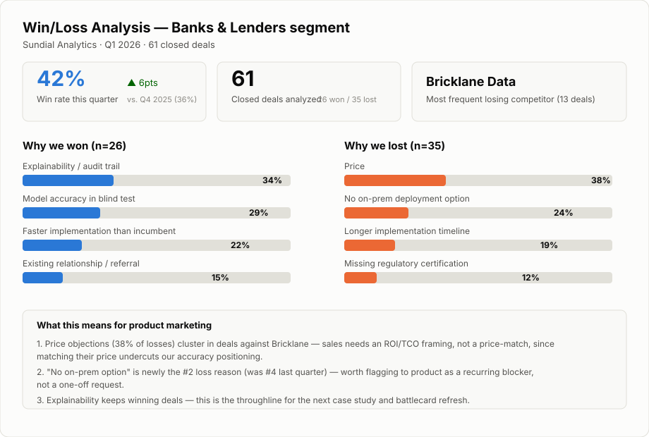

# Win/Loss Analysis

## The problem

Most win/loss "analysis" is a CRM close-reason dropdown nobody trusts, because reps pick whatever's fastest to log. The real reasons a deal was won or lost usually live in call notes, the final email exchange, and the rep's memory — and by the time someone tries to synthesize it quarterly, it's guesswork.

## The approach

Two related outputs, for two different needs:

1. **A quarterly infographic** — takes in raw deal notes (CRM close reasons, rep summaries, call transcript excerpts) across a batch of closed deals, classifies and quantifies the real reasons behind wins and losses, and renders it as one page an exec will actually look at. Opinionated on purpose: it always ends in 2-3 concrete next actions, not just a breakdown of percentages.
2. **A deep-dive analysis** — the same underlying discipline (classify from what actually happened, not the logged shorthand) applied to a full structured CRM export instead of pasted notes, covering five components: buyer demographics, decision drivers, competitor data, product feedback, and sales process insights. Built to answer questions the quarterly infographic isn't structured to hold, like whether response time predicts outcome, or whether the deals we lose skew larger than the ones we win.

## Files — quarterly infographic

- [`skill.md`](./skill.md) — the Claude Skill definition
- [`gpt.md`](./gpt.md) — ChatGPT custom GPT version
- [`win-loss-infographic.svg`](./win-loss-infographic.svg) — sample output, Q1 2026 data for Sundial Analytics' banking segment ([view live ↗](https://tajnelakos.github.io/sundial-analytics/knowledge-base/win-loss-analysis/win-loss-infographic.svg))

## Files — deep-dive analysis

- [`skill.md`](./skill.md)'s "Deep-dive mode" section — the same skill file, extended for this mode
- [`win-loss-crm-export.csv`](./win-loss-crm-export.csv) — 100 fictional closed opportunities, trailing 12 months (Oct 2025–Sep 2026): deal size, sales cycle, lead source, assigned rep, competitor faced, decision driver, product feedback, demo quality, response time. Fifteen of these records are the same accounts documented in [`sales-call-analysis`](../sales-call-analysis), so the qualitative "how the call went" and the quantitative "what closed" are the same underlying deals, not two disconnected data sets.
- [`win-loss-detailed-analysis.html`](./win-loss-detailed-analysis.html) — the full analysis built from that export ([view live ↗](https://tajnelakos.github.io/sundial-analytics/knowledge-base/win-loss-analysis/win-loss-detailed-analysis.html))

A note on file format: this is a CSV, not a true `.xlsx`/`.xls` binary — this environment doesn't have Python or LibreOffice available to build one properly, and a hand-authored binary spreadsheet file is more likely to arrive corrupted than a clean CSV, which Excel, Sheets, and Salesforce itself all read and write natively anyway.

## Current limitations

The infographic mode still takes pasted deal notes directly rather than a live CRM feed. The deep-dive mode is currently a one-time pass against a fixed export rather than something re-run incrementally as new deals close — running it as a rolling trailing-12-months view that updates each quarter, rather than a fixed snapshot, is the natural next step.
